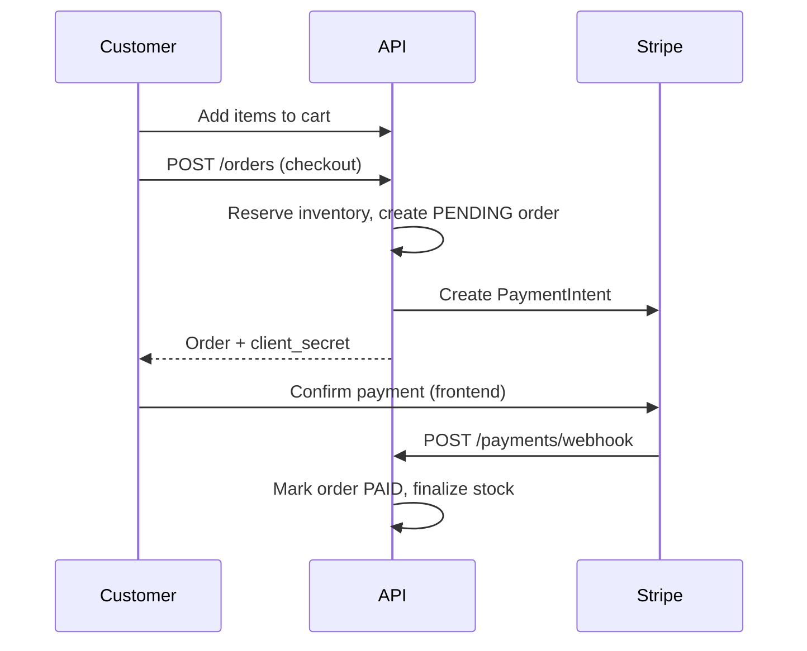

# Online Bookstore

A production-style REST API for an online bookstore built with **Spring Boot 4**, **Java 21**, and **PostgreSQL**. It covers the full lifecycle—from catalog browsing and user accounts through cart checkout, Stripe payments, shipments, and admin reporting.

---

## Features

| Area | Capabilities |
|------|----------------|
| **Authentication** | Register, email verification, JWT access tokens, HTTP-only refresh cookies, password reset, token refresh & logout with blacklist |
| **Catalog** | Books, authors, categories, series, reviews, inventory, search & filters, Redis caching |
| **Commerce** | Shopping cart, checkout with tax/shipping/promotions, Stripe PaymentIntents & webhooks, order cancellation & refunds |
| **Users** | Profiles, addresses, wishlist, in-app notifications |
| **Admin** | User management (promote/demote), inventory, promotions, shipments, JasperReports (JSON + PDF/XML/HTML export) |
| **Operations** | Flyway migrations, soft deletes, scheduled abandoned-order cleanup, Actuator health checks, Docker Compose stack |

---

## Tech Stack

- **Java 21** · **Spring Boot 4.0.2**
- **PostgreSQL 17** · **Flyway** · **Spring Data JPA**
- **Redis** — caching, verification/reset tokens, refresh tokens, JWT blacklist
- **Spring Security** — JWT + role-based access (`CUSTOMER`, `ADMIN`)
- **Stripe** — payments & webhooks
- **Cloudinary** — book/author/series/user image uploads
- **JavaMail + Thymeleaf** — transactional HTML emails
- **MapStruct** · **Lombok** · **Jakarta Validation**
- **SpringDoc OpenAPI** — interactive API docs
- **JasperReports** — admin report exports

---

## Architecture

**Layered packages:** `controller` → `service` → `repository` → `entity`, with DTOs and MapStruct mappers between API and domain layers.

---

## Prerequisites

- **JDK 21**
- **Maven 3.9+** (or use the included `./mvnw` wrapper)
- **Docker & Docker Compose** (recommended for Postgres, Redis, and full-stack runs)
- Optional for local email testing: [MailHog](https://github.com/mailhog/MailHog) or similar SMTP catcher on port `1025`

---

## Quick Start (Docker)

### 1. Configure environment

Create a `.env` file in the project root (Docker Compose reads it). Example:

```env
# Server
SERVER_PORT=8080
SPRING_PROFILES_ACTIVE=prod

# Database
DB_HOST=postgres
DB_PORT=5432
DB_NAME=bookstore
DB_USERNAME=postgres
DB_PASSWORD=postgres
DB_SCHEMA=public

# Redis
REDIS_HOST=redis
REDIS_PORT=6379
REDIS_PASSWORD=

# JWT (use a long random secret in production)
JWT_SECRET_KEY=your-256-bit-secret-key-change-in-production

# Frontend (used in verification & password-reset email links)
FRONTEND_URL=http://localhost:3000
CORS_ORIGINS=http://localhost:3000

# Stripe
STRIPE_SECRET_KEY=sk_test_...
STRIPE_WEBHOOK_SECRET=whsec_...

# Cloudinary
CLOUDINARY_CLOUD_NAME=your_cloud
CLOUDINARY_API_KEY=your_key
CLOUDINARY_API_SECRET=your_secret
CLOUDINARY_FOLDER=bookstore

# Mail (production profile)
MAIL_HOST=smtp.example.com
MAIL_PORT=587
MAIL_USERNAME=your@email.com
MAIL_PASSWORD=your_password

# pgAdmin (optional UI)
PGADMIN_DEFAULT_EMAIL=admin@local.dev
PGADMIN_DEFAULT_PASSWORD=admin

# Cookies (optional)
COOKIE_DOMAIN=
COOKIE_SECURE=false
```

### 2. Start the stack

```bash
docker compose up -d --build
```

| Service | URL / Port |
|---------|------------|
| API | http://localhost:8080 |
| Swagger UI | http://localhost:8080/swagger-ui/index.html |
| OpenAPI JSON | http://localhost:8080/v3/api-docs |
| Actuator health | http://localhost:8080/actuator/health |
| pgAdmin | http://localhost:5050 |
| PostgreSQL | `localhost:5432` |
| Redis | `localhost:6379` |

Application logs are written to `./logs` (mounted in the app container).

---

## Local Development

### 1. Start infrastructure only

```bash
docker compose up -d postgres redis
```

### 2. Create the dev database

```sql
CREATE DATABASE bookstore_dev;
```

The `dev` profile expects Postgres at `localhost:5432` with username/password `postgres` / `postgres` (see `application-dev.yml`).

### 3. Set required variables

At minimum, export or add to `.env`:

```env
JWT_SECRET_KEY=dev-secret-key-at-least-32-characters-long
FRONTEND_URL=http://localhost:3000
STRIPE_SECRET_KEY=sk_test_...
STRIPE_WEBHOOK_SECRET=whsec_...
CLOUDINARY_CLOUD_NAME=dev
CLOUDINARY_API_KEY=dev
CLOUDINARY_API_SECRET=dev
CLOUDINARY_FOLDER=bookstore-dev
```

### 4. Run the application

```bash
# Windows
.\mvnw.cmd spring-boot:run

# Linux / macOS
./mvnw spring-boot:run
```

Active profile defaults to **`dev`** (`SPRING_PROFILES_ACTIVE`).

**Dev mail:** SMTP is configured for `localhost:1025` (MailHog). Start MailHog to capture verification and password-reset emails.

---

## Configuration Reference

| Variable | Required | Description |
|----------|----------|-------------|
| `JWT_SECRET_KEY` | Yes | Secret for signing JWTs |
| `FRONTEND_URL` | Yes | Base URL for email deep links |
| `STRIPE_SECRET_KEY` | Yes* | Stripe API secret key |
| `STRIPE_WEBHOOK_SECRET` | Yes* | Stripe webhook signing secret |
| `CLOUDINARY_*` | Yes* | Image upload credentials |
| `CORS_ORIGINS` | No | Allowed origins (default `*`) |
| `SERVER_PORT` | No | HTTP port (default `8080`) |
| `SPRING_PROFILES_ACTIVE` | No | `dev`, `test`, or `prod` |

\*Required when using payments or image upload endpoints.

### Application settings (`application.yml`)

| Setting | Default | Description |
|---------|---------|-------------|
| Tax rate | 8% | Applied at checkout |
| Shipping | Standard $5, Express $15, Overnight $30, Free $0 | `ShippingMethod` enum |
| Currency | USD | Stripe & pricing |
| Return period | 30 days | Business policy reference |
| Access token TTL | 1 hour | JWT |
| Refresh token TTL | 7 days | Cookie + Redis |
| Catalog cache TTL | 1 hour | Redis (`books` cache) |

---

## API Documentation

Interactive docs are available when the app is running:

- **Swagger UI:** http://localhost:8080/swagger-ui/index.html
- **OpenAPI spec:** http://localhost:8080/v3/api-docs

Use the **Authorize** button and paste: `Bearer <your-access-token>`.

### API overview

All routes are prefixed with `/api/v1`.

| Module | Base path | Notes |
|--------|-----------|-------|
| Auth | `/auth` | Register, login, verify, refresh, password reset |
| Users | `/users` | Profile, admin user management |
| Addresses | `/addresses` | Authenticated |
| Wishlist | `/wishlist` | Authenticated |
| Authors | `/authors` | Public read; follow requires auth; write = admin |
| Categories | `/categories` | Public GET; admin write |
| Series | `/series` | Public GET; admin write |
| Books | `/books` | Public GET/search; admin write; reviews on books |
| Reviews | `/reviews` | Authenticated |
| Inventories | `/inventories` | Admin only |
| Cart | `/cart` | Authenticated |
| Promotions | `/promotions` | Public GET; admin write |
| Orders | `/orders` | Checkout & own orders; admin list all |
| Payments | `/payments` | Own payments; Stripe webhook at `POST /payments/webhook` |
| Shipments | `/shipments` | Own shipments; admin create/update status |
| Notifications | `/notifications` | Authenticated |
| Reports | `/reports` | Admin only |

---

## Authentication

### Register & verify

1. `POST /api/v1/auth/register` — creates a `CUSTOMER` account (email unverified).
2. User receives a verification email (link: `{FRONTEND_URL}/verify?token=...`).
3. `POST /api/v1/auth/verify?token=...` — marks email as verified.
4. `POST /api/v1/auth/login` — returns access token in body; refresh token in **`refresh_token`** HTTP-only cookie.

Login is rejected until the email is verified.

### Authenticated requests

```http
Authorization: Bearer <access_token>
```

### Refresh & logout

- `POST /api/v1/auth/refresh` — reads refresh cookie, returns new tokens.
- `POST /api/v1/auth/logout` — requires `Authorization` header and refresh cookie; revokes tokens.

### Password rules

Passwords must be at least 8 characters and include uppercase, lowercase, a digit, and a special character (`!@#$%^&*`).

---

## Roles & Permissions

| Role | Description |
|------|-------------|
| `CUSTOMER` | Default on registration; browse catalog, manage cart/orders, wishlist, reviews |
| `ADMIN` | Full catalog/inventory/promotion management, reports, all orders & payments |

There is **no seeded admin user**. To bootstrap the first admin:

1. Register a normal account and verify the email.
2. Promote the user in the database:

```sql
UPDATE users SET role = 'ADMIN' WHERE email = 'your@email.com';
```

3. Subsequent admins can be promoted via `PATCH /api/v1/users/{id}/promote` (admin only).

---

## Order & Payment Flow



- **Checkout** calculates subtotal, tax (8%), shipping, and optional promotion discount.
- **Pending orders** older than 30 minutes are cancelled automatically (cron every 15 minutes); inventory is restored and the user is notified.
- **Cancel order** restores stock and issues a Stripe refund when the order was paid.

For Stripe webhooks in development, use the [Stripe CLI](https://stripe.com/docs/stripe-cli):

```bash
stripe listen --forward-to localhost:8080/api/v1/payments/webhook
```

---

## Project Structure

```
src/main/java/com/bookstore/
├── config/           # Security, Redis, Stripe, Cloudinary, OpenAPI, async, scheduling
├── controller/       # REST endpoints by domain
├── dto/              # Request/response records
├── entity/           # JPA entities
├── enums/
├── exception/        # Custom exceptions + GlobalExceptionHandler
├── mapper/           # MapStruct mappers
├── repository/       # Spring Data JPA (+ specifications, projections)
├── scheduler/        # Abandoned order cleanup
├── security/         # JWT filter, token store, UserDetails
├── service/          # Business logic
├── util/
└── validation/       # Custom validators (e.g. password)

src/main/resources/
├── application.yml           # Shared config
├── application-{dev,prod,test}.yml
├── db/migration/             # Flyway (V1 schema, V2 indexes)
├── reports/                  # JasperReports templates
└── templates/                # Thymeleaf email templates
```

---

## Database

Schema is managed by **Flyway** (`src/main/resources/db/migration/`):

- `V1__initial_schema.sql` — tables, constraints, soft-delete columns
- `V2__indexes.sql` — performance indexes

Hibernate `ddl-auto` is **`validate`** in dev/prod (never auto-generates schema).

---

## Testing

```bash
# Windows
.\mvnw.cmd test

# Linux / macOS
./mvnw test
```

Requires **JDK 21** and **Docker** (for integration tests). If Docker is not running, integration tests are skipped automatically; unit tests still run.

| Type | Location | What they cover |
|------|----------|-----------------|
| **Unit** | `src/test/java/com/bookstore/**` (except `integration`) | Pricing, inventory, promotions, orders, auth logic with mocks |
| **Integration** | `src/test/java/com/bookstore/integration/` | Full Spring context + Testcontainers (PostgreSQL 17, Redis 7) |

Integration tests use the `integration` profile and exercise real HTTP flows via `MockMvc` (register → verify → login, role-based security, actuator health).

---

## Health & Monitoring

| Endpoint | Access |
|----------|--------|
| `/actuator/health` | Public |
| `/actuator/info` | Public |
| `/actuator/metrics` | ADMIN  |

---

## Author

**Hassan Tarek**

- GitHub: [@Hassan-Tarek](https://github.com/Hassan-Tarek)
- Email: hassanelashry415@gmail.com

---

## License

This project is licensed under the [MIT License](https://opensource.org/licenses/MIT).
